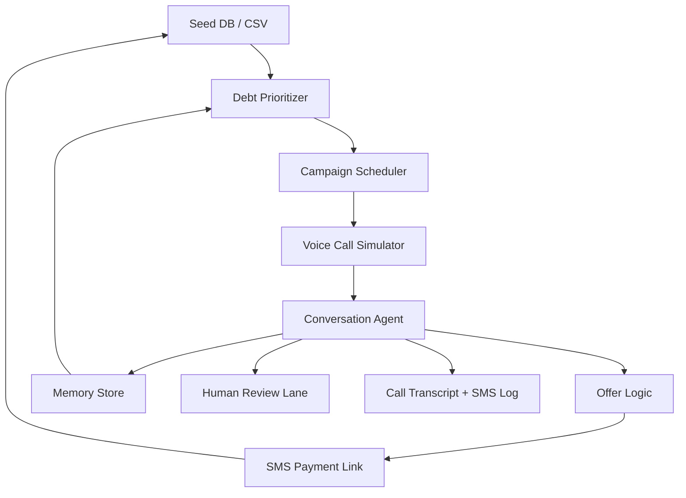

# System Architecture

## High-Level Demo Design

## Components

### Seed DB / CSV

Seed data for borrowers, debts, payments, and agent memory.

### Debt Prioritizer

Ranks debts by urgency, start date, amount, prior engagement, and likely payment outcome.

### Campaign Scheduler

Schedules outreach and follow-up events for the demo timeline.

### Voice Call Simulator

In-app call experience that represents the borrower-agent voice conversation. For the hackathon, this can be implemented as live transcript text with optional speech input/output.

### Conversation Agent

Handles borrower-facing dialogue and chooses a repayment strategy.

### Offer Logic

Simple deterministic rules for discounts and installments.

### SMS Payment Link

Creates demo links like `/pay/:paymentId`, sends them as SMS events, and simulates success, failed, or pending states.

### Memory Store

Stores structured facts learned from interactions, such as salary date, best call time, SMS reminder preference, and promise-to-pay date.

### Human Review Queue

Shows cases that the agent chooses not to handle alone.

### Call Transcript + SMS Log

Readable log of voice transcript, SMS payment links, reminders, offers, and memory updates.

## Design Rule

Make the system feel autonomous while keeping the demo easy to understand. The best demo is a visible loop: borrower selected, voice call happens, offer is made, SMS payment link is sent, status changes.
